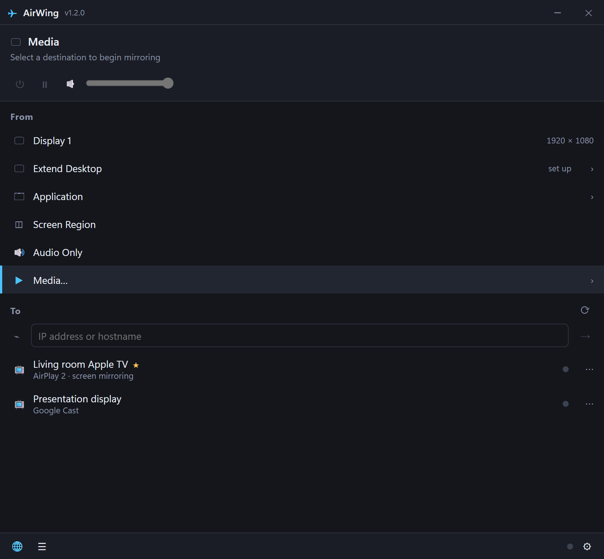

# AirWing

Wireless screen mirroring and media streaming for Windows. Share your desktop, selected windows, media and supported system audio with compatible AirPlay, Google Cast and browser receivers.

## Your screen. A bigger stage.

Take your ideas beyond your desktop. Choose what to share, connect a compatible receiver, and bring your presentation or media to the big screen.

[Explore AirWing](https://lgbtnewsradio-sudo.github.io/airwing/) · [Microsoft Store listing](https://apps.microsoft.com/detail/9N3FMGF9168) · [Privacy policy](https://lgbtnewsradio-sudo.github.io/airwing/privacy.html)



*Actual app interface with sample device names. Store availability is subject to Microsoft review.*

## Features

- Mirror a display, application window or selected region.
- Apple TV screen mirroring with the AirPlay mirroring transport and pairing when required.
- Experimental AirPlay system audio in v1.2.1, plus a compact window that opens on the right side of your screen.
- Realtime Google Cast mirroring: VP8, encrypted RTP, bounded pacing and packet repair. Opus system audio is available when the encoder and receiver accept it.
- Lowest delay, Balanced and Best picture presets, plus optional automatic Cast bitrate reduction under loss and gradual recovery.
- Browser playback, phone remote, direct media playback, favorites, tray controls and hotkeys.
- Connection health: transport, encoded dimensions, measured send FPS, bitrate, audio availability and available loss statistics. Target delay is not measured screen-to-screen latency.
- Local privacy-safe support export and Windows-protected pairing keys.

Cast uses separate VP8/Opus encoders alongside the H.264/AAC path. Simultaneous receivers share encoders; capacity depends on your PC, network and receivers. Hardware acceleration is requested, not guaranteed.

## Compatibility and verification

| Receiver | Evidence | Notes |
| --- | --- | --- |
| Apple TV 4K | Video confirmed working with 1.1.9 | 1.2.1 adds experimental ALAC mirroring audio; physical-device audio validation is pending. |
| Hisense Android TV projector | User confirmed the 1.1.10 lag/glitch fix works | New 1.2.0 audio and adaptive quality still need physical-device verification. |
| Sony Bravia Cast | Earlier negotiation/video tests | Not confirmation of the newest release. |
| Other Cast/AirPlay devices | Protocol/mock tests; compatibility varies | Report model, software version and support bundle. |
| Browser receiver | Automated local playback tests | Timing depends on device, browser and network. |

Realtime Cast may fall back to buffered HLS when mirroring negotiation is unsupported. HLS is not expected to match realtime mirroring latency. AirPlay speakers and third-party TVs require model-specific validation.

## Use

1. Select a source in From. The default display may start capture automatically. The title bar shows capture activity; Stop or Quit ends it.
2. Select a destination in To. Enter an on-screen pairing code if requested. Click again to disconnect.
3. Choose quality and Cast audio in Settings before the next capture. Audio requires an available system-audio track; current Cast audio requires 48 kHz input. Unsupported configurations remain video-only and are labeled accordingly.

4. For browser viewing, open the displayed local URL. Enable access codes on shared networks. HTTP/browser playback is not encrypted; do not expose the server to the internet.
5. Closing the window keeps AirWing in the tray. Use Stop mirroring or Quit to end capture.

AirPlay mirroring audio in 1.2.1 uses the source's “Include audio” setting and converts captured sound to stereo 44.1 kHz ALAC. Unsupported audio setup leaves video mirroring running. The initial AirPlay stream volume is -12 dB; volume and mute controls are available during mirroring. Audio interoperability still needs testing on physical receivers.

The main window opens 375 pixels wide near the right edge of the display containing the pointer, within the usable desktop area. It remains movable and resizable.

Default shortcuts: Ctrl+Shift+M start/stop, Ctrl+Shift+P pause/resume, Ctrl+Shift+X stop everything.

New installer versions add an inbound rule for private networks only. Settings provides an explicit public-network choice with administrator approval. Portable users may need to configure Windows Firewall themselves. Store editions use Windows Security instead of installer firewall commands.

Extended desktop requires a separately installed compatible virtual display driver; no driver is bundled or silently installed.

## Diagnostics and privacy

Export a support bundle from Diagnostics. It includes versions, preferences, session health and recent logs; known tokens, pairing secrets, usernames and selected media paths are redacted. Nothing is uploaded automatically. Review before sharing: local addresses, receiver names and arbitrary device messages may remain.

Settings and logs live in the app's user-data directory. Pairing keys in credentials.json are encrypted for the Windows account; legacy plaintext entries migrate when secure storage is available. New keys are memory-only if encryption is unavailable. Forget pairing removes saved keys.

See [privacy](docs/PRIVACY.md) and [Store preparation](docs/STORE.md).

## Build and test

Use Windows and Node.js 24 with the committed dependencies.

```powershell
npm install
npm run typecheck
npm test
npm run build
npm run test:e2e
npm run dist
```

Installer and ZIP output goes to release. Store packaging is separate: npm run store:check and npm run dist:store require your real Partner Center identity. Source tests do not establish certification.

## Get AirWing

Get the packaged app through the [Microsoft Store listing](https://apps.microsoft.com/detail/9N3FMGF9168). Availability and updates are subject to Microsoft review. Free installer and portable downloads are no longer distributed through GitHub releases.

This repository and its version tags provide the corresponding GPL source for distributed versions; they are not a Store purchase or a packaged-app download.

## Limitations

- Packet repair and bounded queues cannot guarantee glitch-free playback on every network.
- Quality adaptation uses available receiver loss reports; absent reports do not justify inferred recovery or display-latency claims.
- Local browser viewing can feed captured audio back; the viewer starts muted on the capturing PC.
- Actual Store packaging/certification and new audio-device verification must be completed before advertising those results.
- There is no bundled automatic updater. Microsoft manages Store updates.

## License

GPL-3.0-or-later. See LICENSE and NOTICE. Provide corresponding source for each distributed binary. AirWing is independent and not affiliated with Apple, Google, Microsoft or Squirrels; their marks belong to their respective owners.
